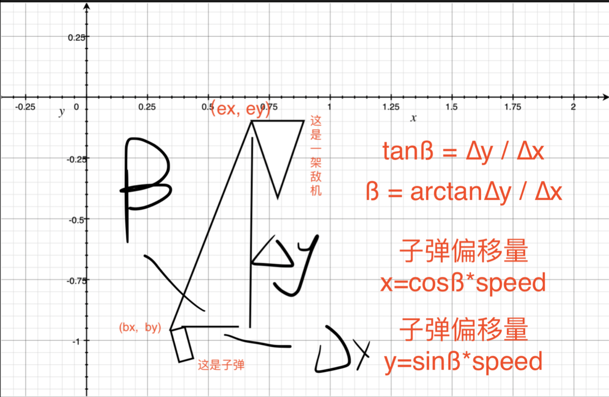
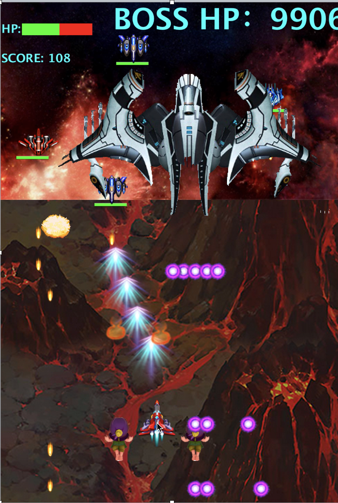

# Aircraft Battle
### Game instructions
- Click the start button, then you will have to choose an aircraft.
- After selecting, the player can start the game.
### Operating instructions
- Use the mouse to move the airplane
- The hero plane will shoot automatically
- Press key **A** to switch to aircraft1, key **S** to switch to aircraft2 and key **D** to switch to aircraft2
- Press key **Z** to add fire power and key **X** to reduce fire power
- Press key **C** to open the protective shield
- Press key **V** to summon wingman
- Press key **B** to change shoot mode(Normal/**Homing Bullet**)
- Press key **N** to enter SICKO MODE

### Funtions
1. The player can choose his hero plane among three planes.
2. Ranking List
3. Firepower system
4. Homing Bullet

   
5. SICKO MODE

# Presentation
